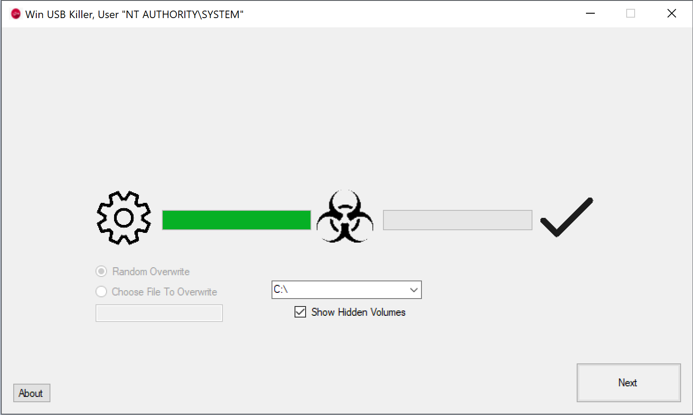

# WinUSBKiller
You don't have a USB Killer and you still wanna destroy your school computer ?

WinUSBKiller is a GUI open source tool made with C++ and C# and can be used to weaponize USB sticks against windows installations.

# How does the tool work

The tool exploit an arbitrary file overwrite in windows search indexer service, with a crafted symbolic link an attacker could overwrite arbitrary files with just a USB stick.

The tool offer 2 ways to exploit the issue.

1. Random overwrite

The tool will choose a random driver to be target in the overwrite operation so as soon as the victim try to reboot it won't boot because of the overwritten critical driver. A random target is being chosen for the overwrite operation in order to make it harder to fix.

2. Choose file to overwrite

If you know the path to a specific file and you want to overwrite it, you can choose this option. The tool will allow to specify the file to overwrite, so as soon as you plug the USB stick you can overwrite or create the target file or directory.

# How to run

Make sure to install .NET framework 4.7.2 and also make sure to put "WUSBKiller.exe" and "WUSBKillerLib.dll" in the same directory, and run it as administrator.

# FAQ

# The tool is it safe ?

No, currently the tool is under testing for the moment it's considered as completely unstable, let's say it can compromise the attacker by itself, consider using the tool in a virtual machine.

# Any command-line version available ?

No, for the moment there's no console tool made to exploit the issue.

# Someone kids exploited the issue in my PC what can I do ?

Consider reinstalling windows.

# How to fix the USB after the infection ?

Use linux to format the USB

# Does the tool work with Mac, linux, android, IOS ...?

No the tool only work on windows and only exploit windows machines.

# Why does the tool work only with NTFS drives ?

Because only NTFS drives are supported by windows, and allow the creation of symbolic link and data stream.
 
# Who created the tool and for what purpose the tool was made for ?

The tool was made for offensive pentesting, security researchers and educational purposes.
It was written by Abdelhamid Naceri

# What are the windows installations affected by the USB exploit ?

Currently, the tool has been tested on Windows 10 20H2 with latest security patches, while the tool wasn't tested against windows server, windows 8 and windows 7. But I assume that the bug exist on all default windows installations.

# What are the privileges required to exploit the issue ?

No privileges are required to exploit the issue, the only thing you might need is to have phisycal access (e.g pluging the USB stick in the pc). The exploit will also work from the lockscreen and no need to login or to unlock the screen.

# How much time is required to exploit the issue

As soon windows machine recognize the infected USB stick, it will trigger the exploit. Let's say about 2-4 second is enough.

# Use the tool responsibly I am not responsible for any damage, exploits or broken devices.
